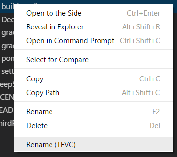

# Team Foundation Version Control (TFVC) Support

This extension provides TFVC support by way of the Source Control Viewlet in Visual Studio Code.

Here are the currently supported features provided by the extension:
- Execute all basic version control actions such as add, delete, rename, move, etc.
- View local changes and history for your files
- Include and Exclude changes (and move files between the two states)
- Merge conflicts from updates
- Check-in and update local files
- Associate work items to check-ins
- Integrated TFVC Output window
- Support for a TFS proxy
- Support for **local** workspaces created with either Visual Studio, the JetBrains IDEs or Eclipse ([details](#what-is-the-difference-between-a-local-and-server-workspace-how-can-i-tell-which-one-im-working-with))


## Getting Started Videos
Below are a few videos to help get you started using TFVC quickly.
- [TFVC Source Code Control for Visual Studio Code](https://youtu.be/6IzJ2UPGmoQ) - This video shows you how to set up
the TFVC support on Windows and demonstrates much of the functionality available for Team Foundation Version Control. The
features shown in this video apply equally well to the TFVC support on macOS and Linux.
- [Set up and Configure the TEE CLC on Linux (and macOS)](https://youtu.be/VPNaEIVZfr0) - This video demonstrates how to set
up the Team Explorer Everywhere Command Line Client (TEE CLC) on Ubuntu. On macOS and Linux, the CLC provides the TFVC capability
to the extension.
- [Set up the Team Services extension for Visual Studio Code](https://youtu.be/t6gGfj8WOgg) - If you haven't used the extension
before, this video will show you how to set it up, create a personal access token and get up and running.
- [Walkthrough of the Team Services extension for Visual Studio Code](https://youtu.be/sk6LrzQX4P8) - This is a walkthrough of
most of the features of the Team Services extension.

## Prerequisites
### Visual Studio Team Services
If you are planning on using the extension with Visual Studio Team Services, ensure you have a Team Services account. If you do
not have an account, find out how to [sign up for Team Services](https://www.visualstudio.com/en-us/get-started/setup/sign-up-for-visual-studio-team-services).

### Team Foundation Server
If you are planning on using the extension with Team Foundation Server, you **must** be running Team Foundation
Server 2015 Update 2 or later. Earlier versions of Team Foundation Server are not supported.

## Installation
First, you will need to install [Visual Studio Code](https://code.visualstudio.com/download) `1.11.1` or later.

### The Visual Studio Code Extension
To install the extension with the latest version of Visual Studio Code (version 1.11.1 is the latest as of this writing), bring
up the Visual Studio Code Command Palette (`F1`), type `install` and choose `Extensions: Install Extensions`. In the `Search Extensions in Marketplace`
text box, type `team`. Find the `Visual Studio Team Services` extension published by *Microsoft* and click the `Install` button.
Restart Visual Studio Code.

### TFVC Command Line Client
In order to provide TFVC support in Visual Studio Code, the extension relies on the use of a TF command line client. Therefore,
you will need to have one already installed and configured. TFVC support will not work without an available command line client.

#### Visual Studio IDE (Windows)
With a typical installation of Visual Studio, the Windows version of the TFVC command line client (tf.exe) is available under
the `Program Files (x86)` folder. It will typically be placed in a location similar to
`C:\Program Files (x86)\Microsoft Visual Studio 14.0\Common7\IDE\TF.exe`. On the 2017 version of Visual Studio, it can be found in a location similar to `C:\Program Files (x86)\Microsoft Visual Studio\2017\Professional\Common7\IDE\CommonExtensions\Microsoft\TeamFoundation\Team Explorer\TF.exe`.

#### Eclipse, JetBrains IDEs (Windows, macOS, Linux)
If you typically use Eclipse or one of the JetBrains IDEs (e.g., Android Studio, IntelliJ), you will need to download and
extract a version of the Team Explorer Everywhere Command Line Client (TEE CLC). As of this update, the latest version can
be downloaded from [TEE-CLC-14.114.0.zip](https://github.com/Microsoft/team-explorer-everywhere/releases/download/v14.114.0/TEE-CLC-14.114.0.zip).
After downloading, extract it to a folder and open a Terminal window.

From that Terminal window, ensure that at least Java 8 is installed and available (run `java -version` to check
the version). Once Java is configured properly, you will need to accept the TEE End User License Agreement by
running `tf eula`. Make sure to read the EULA and accept it by entering `y`. The extension will not function properly
until this EULA is accepted.

If you are using the TEE CLC, see how to set it up by viewing [this video](https://youtu.be/VPNaEIVZfr0).

## Authentication
### Visual Studio Team Services
If you are connecting to Team Services, you will need a personal access token (PAT) to securely access your account.
The latest version of the extension will prompt for your token and store it securely. In previous versions of the
extension, you needed to create a token and store it in your Visual Studio Code settings.

If you do not have a personal access token yet, you will need to create one on your Team Services account.
To create the token, go [here](https://aka.ms/gtgzt4) to read how. You can also [view our video](https://youtu.be/t6gGfj8WOgg)
on how to do the same.
* TFVC repositories require tokens with *All Scopes*. Anything less will cause the extension to fail.

### Team Foundation Server
If you are connecting to Team Foundation Server, you will only need your NTLM credentials (domain name, account name
and password). It is assumed that you have the proper permissions on the TFS Server.

## Configure TFVC Support
To configure TFVC support, you must provide the location to the TF command line client used by the extension to perform
TFVC actions. To set this location, add the following entry to Settings (**File > Preferences > Settings**):
```javascript
    "tfvc.location": "<path-to-tf-command-line>"
```
If you plan to use the TFVC command line provided by the Visual Studio IDE, the value to provide will be similar to `C:\\Program Files (x86)\\Microsoft Visual Studio 14.0\\Common7\\IDE\\TF.exe`.

If you plan to use the TEE CLC, the value to provide will be similar to `/home/username/TEE-CLC-14.114.0/tf`. On Windows,
the entry should point to `tf.cmd`. On macOS and Linux, it should point to the script `tf`. If you are using the TEE CLC,
see how to do this by viewing [this video](https://youtu.be/VPNaEIVZfr0).

## Team Foundation Version Control
To get an overview of the TFVC support provided by the extension, view [this video](https://youtu.be/6IzJ2UPGmoQ). Although
it demonstrates the extension running on Windows, the TFVC functionality will work the same on macOS and Linux. Further
information is detailed below.

### Open a local TFVC Repository folder
Once you have installed the extension, open either the root folder or a sub-folder of the TFVC repository. Once a Team
Services or Team Foundation Server 2015 Update 2 (or later) repository is detected by the extension, you will need to provide
your credentials (if credentials weren't already found). If you are required to provide your credentials, there will be an
indicator in the status bar whose message will indicate that you need to sign in.

The indicator looks like this:


To sign in to your account, run the `team signin` command or simply click on that indicator. If your repository
is a Team Services repository, you will be prompted to enter your personal access token. When you do, it will be
stored securely on your computer and used to connect to Team Services. If your repository is on Team Foundation 
Server 2015 Update 2 or later, you will be prompted to enter your username and password. After both are provided, they will
be stored securely on your computer and used to connect to your TFS server.

Once your credentials are verified, the status bar indicators will be active and the remaining commands will
be ready to use. The stored credentials will be used for each connection to the server until they are either
removed by the `team signout` command or overwritten by a subsequent `team signin` command.

**Note:** In order for the extension to be activated, a repository *folder* must be opened. The extension
won't be activated if only a single *file* in the repository is opened.

### The TFVC Source Control Viewlet


This is the Team Foundation Version Control Viewlet. It displays lists of any conflicting changes (to be resolved before
the next check-in), included changes (changes to be included in the next check-in), excluded changes (changes to keep but
excluded from check-in). The viewlet also provides right-click context menus to allow additional functionality like Undo,
Include and Exclude.

#### Check In and Refresh

* `Check In` – This `check mark` button is used to check in your changes. You will not be prompted for a comment so make sure you provide
one before clicking.
* `Refresh` – This `circular arrow` button runs the TFVC `Status` command and processes the results.

#### The '...' Menu
This menu provides access to additional commands provided by the TFVC source provider.


* `Sync` – This option runs the `Get` command and handles any conflicts or errors.
* `Associate Work Items` – In order to associate work items to your check-in, select this option. The list of work items
assigned to you (or returned from your custom query) will be displayed for you to choose. Choosing one adds it to your check-in comment.
* `Check In` – Use this option to check in your changes.
* `Undo All` - If there are file modifications, this command will prompt for confirmation and then undo all of the changes.
* `Show TFVC Output` – Use this option to display the `TFVC Output` window which shows the TFVC commands run during this session.
* `Switch SCM Provider... >` – This option is provided by VS Code and allows you to change between the available source control
providers (e.g, Git, TFVC, etc.).

#### Resolving Conflicts
When conflicts need to be resolved, you can use these commands to do so. There are inline icons which also provide this functionality.


* `Open Diff` – Opens the diff view between the modified file and the versioned file.
* `Open File` – Opens the modified file in the editor.
* `Resolve: Take Theirs` – Resolves the conflict as `Take Theirs`.
* `Resolve: Keep Yours` – Resolves the conflict as `Keep Yours`.
* `Undo` – Reverts the changes made to the file.

***Note:*** Resolving conflicts between branches is not supported in the extension. At this time, these conflicts are best addressed
in an IDE or at the command line.

### File Explorer
Access to renaming a file is provided on Visual Studio Code's File Explorer menu.



* `Rename (TFVC)` – To properly rename a file in TFVC using the `Rename` command (instead of `Delete` and `Add`), use this option on
Visual Studio Code's File Explorer. You will prompted for a new file name.

## Additional Information
### Specifying a TFS Proxy
To configure a TFS proxy server, you must provide the URL to that server in the Visual Studio Code Settings (**File > Preferences > Settings**):
  ```javascript
    "tfvc.proxy": "http://servername:9999/proxy"
  ```

### Restricting Status changes to the current VS Code Workspace
By default, TFVC support shows status across the entire mapped workspace regardless of the folder you may have open in Visual Studio Code. If you
prefer to see just the status of changes for the currently opened VS Code workspace, you can do so by setting the following flag in the Visual
Studio Code Settings (**File > Preferences > Settings**):
  ```javascript
    "tfvc.restrictWorkspace": true
  ```

## Frequently Asked Questions
### *Is it required that I have a TFVC workspace already on my local machine to use the TFVC support?*
With release 1.116.0, yes, it is a requirement that you have an existing workspace on your local machine.

### *Can I use the Team Explorer Everywhere Command Line Client (TEE CLC) to provide the TFVC functionality on Windows?*
Yes. If you use Eclipse or one of JetBrain's IDEs (e.g, Android Studio, IntelliJ) on Windows, then you will want to use the TEE CLC to provide
the TFVC support.

### *How do I set up the CLC on Windows?*
While the TEE CLC is primarily for macOS and Linux users it can also be used on Windows. In order to use the CLC on Windows, you need to do the following:
- Download and install a version of [Java 8 for Windows](http://www.oracle.com/technetwork/java/javase/downloads/jre8-downloads-2133155.html).
  - Make sure to install the version (i.e., x86 or x64) that matches your processor architecture
- Ensure the path to `java.exe` is a part of your `PATH` environment variable.
  - Check that you can successully run `java -version`
- Download and unzip the [latest version](https://github.com/Microsoft/team-explorer-everywhere/releases) of the TEE CLC to a local folder of your choice.
  - The file you need to download is of the format `TEE-CLC-14.114.0.zip`
- Open a command prompt and run `{path-to-tf.cmd} eula` and accept the End User License Agreement.
- From within Visual Studio Code, update your `tfvc.location` setting to the full path to `tf.cmd` (e.g., `C:\TEE-CLC-14.111.1\tf.cmd`).
- The last thing that you **must** do is run the `tf workspaces` command as detailed [here](#i-have-workspaces-created-with-visual-studio-can-i-use-the-tee-clc-to-work-with-them) so that the CLC is aware of the workspaces in the specified collection. (Each tool, tf.cmd and tf.exe, keeps its own local cache of workspaces.)

Finally, there's also a [video](https://youtu.be/VPNaEIVZfr0) that shows how to do this on Linux (the same high-level steps apply on Windows).

### *Which instructions do I follow to set up TFVC functionality on the macOS?*
You will follow the same instructions for setting up the TEE CLC as is shown on Ubuntu in [this video](https://youtu.be/VPNaEIVZfr0).

### *I have workspaces created with Visual Studio. Can I use the TEE CLC to work with them?*
This should be possible. However, you will need to make the TEE CLC aware of those workspaces by running the `tf workspaces -collection:<collection-url>` command.

### *Where is the support for Server workspaces?*
At this time, it's still on the backlog. The issue tracking support for Server workspaces is [here](https://github.com/Microsoft/vsts-vscode/issues/176).

### *What is the difference between a Local and Server workspace? How can I tell which one I'm working with?*
You can read about the differences between the two in [our documentation](https://www.visualstudio.com/en-us/docs/tfvc/decide-between-using-local-server-workspace).
Using `tf.exe` on Windows, you can determine which type of workspace you have by running `tf workfold` from the folder where your workspace resides. When you do, a dialog box similar to the one below will be displayed and you can see the type of workspace in the `Location` field (you may need to click the `Advanced >>` button). To change
the type of workspace, update the `Location` field and click `OK`.


## Further Information
For information on other features of the extension, support, licensing, privacy, or contributing code, please review the main [README](README.md) file.
